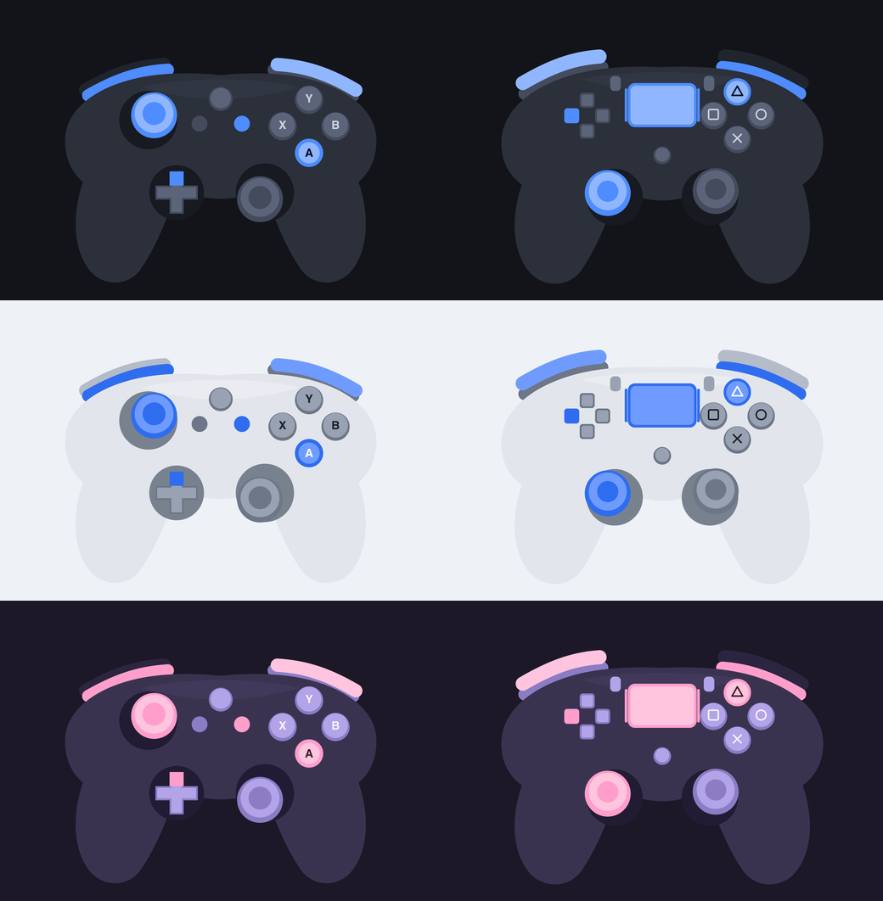

# OBS Input Visualizer

Show your controller on stream. Add one source to OBS and your button presses,
stick movement and trigger pulls appear live.



- **Xbox and PlayStation layouts**, switched automatically to match the pad you
  plug in.
- **Analog triggers and sticks** — a half-pulled trigger shows as half lit, not
  just on or off.
- **Three themes**, and a transparent background so it drops straight onto your
  scene.
- **Keyboard and mouse** overlay too, if you want it.

Currently macOS only. The renderer is cross-platform; only the input capture
still needs a Windows backend.

---

## Install

Grab the latest release, unzip it, and put `input-visualizer.plugin` here:

```
~/Library/Application Support/obs-studio/plugins/
```

Create the `plugins` folder if it isn't there. To install for every user on the
machine, use `/Library/Application Support/obs-studio/plugins/` instead.

Then restart OBS.

> Building from source instead? See [docs/BUILDING.md](docs/BUILDING.md).

## Add it to your scene

1. In OBS, click **+** under Sources.
2. Pick **Input Visualizer**.
3. Give it a name and click **OK**.

That's it. Plug in a controller and it appears.

**No controller handy?** Turn on **Preview mode** in the source settings. It
cycles through every button so you can position and style the overlay first,
then switch it off when you're done.

## Settings

Right-click the source → **Properties**.

### Controller

| Setting | What it does |
|---|---|
| **Layout** | Leave on `Auto-detect` and it follows whatever you plug in. Set it to `Xbox` or `PlayStation 5` to lock one. |
| **Detected** | Read-only. Tells you which controller OBS actually sees, so you can tell whether auto-detect got it right. |

### Appearance

| Setting | What it does |
|---|---|
| **Theme** | `Dark`, `Light`, or `Pastel`. |
| **Size** | How big the overlay is. `0.5` gives a 500x340 source. You can also just drag the corners in your scene. |
| **Opacity** | Fade the whole thing out. |
| **Draw backdrop** | Adds a solid panel behind the controller. Off by default, so the background stays transparent. |

### Behaviour

| Setting | What it does |
|---|---|
| **Hide when no controller is connected** | The overlay fades away when you unplug. Off by default, so the pad stays visible while you set your scene up. |
| **Preview mode** | Animates every input without a controller. Handy for positioning. |

### Keyboard & mouse

Off by default. Tick the box to add a WASD + modifier + mouse-button strip below
the pad.

This one needs permission: **System Settings → Privacy & Security →
Accessibility**, then add OBS and restart it. The controller overlay works
without this — only the keyboard and mouse part needs it.

## Troubleshooting

**The source isn't in the + menu.**
The plugin didn't load. Check the layout is exactly
`…/obs-studio/plugins/input-visualizer.plugin/Contents/MacOS/input-visualizer` —
a loose `.so` file will not be picked up. Then check
**Help → Log Files → View Current Log** and search for `input-visualizer`.

**Nothing appears when I press buttons.**
Check the **Detected** line in Properties. If it says no controller is
connected, macOS isn't seeing the pad — try re-pairing it in Bluetooth settings.
Xbox and DualSense pads work over both USB and Bluetooth.

**The wrong controller is showing.**
Set **Layout** to the one you want instead of `Auto-detect`. Third-party pads
often report themselves generically, and fall back to the Xbox layout.

**Keyboard keys don't light up.**
That's the Accessibility permission above. After granting it, fully quit and
reopen OBS — it's only read at startup.

**The overlay is cut off or stretched.**
It keeps its aspect ratio and centres itself, so if the source box is the wrong
shape you'll see gaps. Right-click the source → **Transform** → **Fit to
screen**, or reset the transform.

## Customising

Themes are just colours, and adding one means writing a palette — no redrawing.
Controller art is plain SVG you can edit.

See [docs/THEMES.md](docs/THEMES.md) for the palette names, the layout format,
and how to add your own theme or controller.

## More

- [Installing](docs/INSTALLATION.md)
- [Building from source](docs/BUILDING.md)
- [Every source setting](docs/OBS-SOURCE.md)
- [Themes and controller art](docs/THEMES.md)
- [Roadmap](docs/ROADMAP.md)

## License

MIT. All controller art is original to this project — see
[docs/THIRD-PARTY.md](docs/THIRD-PARTY.md).
